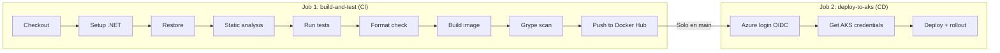

# app-cicd

API de gestión de biblioteca (Library Management) construida con .NET 10, desplegada en Azure Kubernetes Service (AKS) mediante un pipeline CI/CD completamente automatizado. Cada push a `main` compila, prueba, analiza, escanea vulnerabilidades, publica la imagen Docker y despliega a producción sin intervención manual.

[](https://github.com/cristiancave/app-cicd/actions/workflows/ci.yml)
[](https://hub.docker.com/r/cristiancave/app-cicd)
[](#despliegue-en-aks)

## La aplicación

La API simula un sistema de gestión de biblioteca que permite administrar libros y préstamos. Se eligió este dominio porque tiene lógica de negocio real (validación de copias disponibles, cálculo de vencimientos, estadísticas) que va más allá de un CRUD básico y demuestra un caso de uso realista.

### Endpoints disponibles

**Health Check:**
| Método | Endpoint | Descripción |
|---|---|---|
| `GET` | `/health` | Estado de la aplicación. Usado por Kubernetes para readiness y liveness probes |
| `GET` | `/swagger` | Documentación interactiva OpenAPI (Swagger UI) |

**Libros:**
| Método | Endpoint | Descripción |
|---|---|---|
| `GET` | `/api/books` | Listar todos los libros |
| `GET` | `/api/books/{id}` | Obtener libro por ID |
| `POST` | `/api/books` | Registrar un nuevo libro |
| `PUT` | `/api/books/{id}` | Actualizar un libro existente |
| `DELETE` | `/api/books/{id}` | Eliminar un libro |
| `GET` | `/api/books/available` | Filtrar libros con copias disponibles |
| `GET` | `/api/books/genre/{genre}` | Filtrar por género (Fiction, NonFiction, Science, Technology, History, Art, Philosophy) |
| `GET` | `/api/books/search?query=texto` | Buscar por título o autor |

**Préstamos:**
| Método | Endpoint | Descripción |
|---|---|---|
| `GET` | `/api/loans` | Listar todos los préstamos |
| `POST` | `/api/loans` | Crear préstamo (reduce copias disponibles automáticamente) |
| `POST` | `/api/loans/{id}/return` | Devolver libro (actualiza estado y aumenta copias disponibles) |
| `GET` | `/api/loans/active` | Filtrar préstamos activos |
| `GET` | `/api/loans/overdue` | Filtrar préstamos vencidos |

**Estadísticas:**
| Método | Endpoint | Descripción |
|---|---|---|
| `GET` | `/api/stats` | Total de libros, préstamos activos, libros más prestados |

### Lógica de negocio

- Al crear un préstamo, la API **valida que haya copias disponibles** del libro. Si no hay, retorna `400 Bad Request`.
- Al crear un préstamo, `availableCopies` del libro se **reduce automáticamente**.
- Al devolver un libro, `availableCopies` se **incrementa**, `returnDate` se registra y `status` cambia a `Returned`.
- El endpoint `/api/loans/overdue` compara `dueDate` con la fecha actual para detectar préstamos vencidos que aún no se han devuelto.

## Estructura del repositorio

```
app-cicd/
├── AppCicd/                       # Código fuente de la API
│   ├── Program.cs                 # Endpoints Minimal API + Swagger
│   ├── Models/                    # Modelos de datos (Book, Loan, Enums)
│   ├── AppCicd.csproj             # Proyecto .NET con analizadores Roslyn
│   └── appsettings.json           # Configuración de la aplicación
├── AppCicd.Tests/                 # Pruebas unitarias y de integración
│   ├── *Tests.cs                  # Tests con xUnit + WebApplicationFactory
│   └── AppCicd.Tests.csproj       # Proyecto de tests
├── .github/
│   └── workflows/
│       └── ci.yml                 # Pipeline CI/CD (GitHub Actions)
├── Dockerfile                     # Multi-stage build (SDK → Runtime)
├── .dockerignore                  # Excluye bin/, obj/, .git del contexto Docker
├── .gitignore                     # Excluye archivos de compilación
└── README.md
```

## Pipeline CI/CD

El archivo `ci.yml` define dos jobs que se ejecutan en secuencia:



### Job 1: build-and-test (CI)

Se ejecuta en **cada push y pull request**. Incluye 9 steps:

| Step | Qué hace | Por qué es importante |
|---|---|---|
| **Checkout** | Descarga el código del repositorio | Punto de partida de todo pipeline |
| **Setup .NET** | Instala el SDK de .NET 10 en el runner | El runner de GitHub no tiene .NET preinstalado |
| **Restore dependencies** | Descarga paquetes NuGet | Separado del build para aprovechar cache |
| **Static code analysis** | Compila con `--warnaserror` + analizadores Roslyn | Detecta bugs potenciales, code smells y vulnerabilidades en tiempo de compilación. `TreatWarningsAsErrors` garantiza que ningún warning llega a producción |
| **Run tests** | Ejecuta pruebas con xUnit | Valida que la lógica de negocio funciona correctamente. Incluye pruebas de integración con `WebApplicationFactory` que levantan la API en memoria |
| **Code format check** | Verifica formato con `dotnet format --verify-no-changes` | Asegura consistencia de estilo en todo el código. Si alguien sube código mal formateado, el pipeline falla |
| **Build Docker image** | Construye la imagen con multi-stage build | Genera la imagen que se va a desplegar. Multi-stage reduce el tamaño final de ~800MB (SDK) a ~200MB (runtime) |
| **Security scan (Grype)** | Escanea la imagen Docker buscando vulnerabilidades | Detecta CVEs conocidos en la imagen base y dependencias. Si encuentra vulnerabilidades críticas, el pipeline falla y la imagen no se publica |
| **Push to Docker Hub** | Publica la imagen en el registro | Solo se ejecuta si todos los pasos anteriores pasaron, incluyendo el escaneo de seguridad |

### Job 2: deploy-to-aks (CD)

Se ejecuta **solo en la rama `main`** y solo si el Job 1 fue exitoso:

| Step | Qué hace | Por qué es importante |
|---|---|---|
| **Azure login (OIDC)** | Se autentica en Azure sin contraseñas | Usa credenciales federadas: GitHub presenta un token temporal y Azure lo valida contra la relación de confianza configurada. No hay secretos almacenados |
| **Get AKS credentials** | Descarga el kubeconfig del cluster | Permite ejecutar comandos `kubectl` contra el cluster AKS |
| **Deploy to AKS** | Actualiza la imagen y reinicia los pods | `kubectl set image` cambia la imagen del deployment, `kubectl rollout restart` fuerza la actualización, `kubectl rollout status` espera confirmación |

### ¿Por qué Grype y no Trivy?

En marzo de 2026, Trivy (Aqua Security) sufrió un ataque a la cadena de suministro (CVE-2026-33634) que comprometió GitHub Actions, binarios de release e imágenes Docker Hub. Los atacantes inyectaron malware que exfiltraba credenciales de CI/CD (tokens, SSH keys, Kubernetes tokens) desde los runners. Se seleccionó **Grype** (Anchore) como alternativa segura y open source para el escaneo de vulnerabilidades de imágenes Docker.

## Dockerfile

La imagen usa **multi-stage build** para optimizar tamaño y seguridad:

```
Stage 1 (build):  SDK ~800MB  → Compila y publica la app
Stage 2 (final):  Runtime ~200MB → Solo copia los binarios compilados
```

Beneficios:
- **Imagen final ~75% más pequeña** que si incluyera el SDK completo.
- **Sin código fuente** en la imagen final, solo binarios compilados. Más seguro.
- **Sin herramientas de desarrollo** (compilador, debugger) que podrían ser explotadas.
- **Cache de capas:** se copia primero el `.csproj` y se restauran dependencias antes de copiar el código. Si las dependencias no cambian, Docker usa cache y el build es más rápido.

## Pruebas

El proyecto incluye pruebas de integración con **xUnit** y **WebApplicationFactory** que levantan la API en memoria y ejecutan peticiones HTTP reales contra ella:

- Health check retorna 200 OK
- CRUD completo de libros (crear, leer, actualizar, eliminar)
- Filtros por género, disponibilidad y búsqueda
- Creación de préstamos reduce copias disponibles
- Préstamo falla si no hay copias (400 Bad Request)
- Devolución incrementa copias y cambia estado
- Filtro de préstamos activos y vencidos
- Estadísticas retornan datos correctos

Los tests se ejecutan automáticamente en cada push como parte del pipeline CI.

## Análisis estático de código

El proyecto tiene habilitados los analizadores de Roslyn de .NET con la configuración más estricta:

```xml
<TreatWarningsAsErrors>true</TreatWarningsAsErrors>
<EnforceCodeStyleInBuild>true</EnforceCodeStyleInBuild>
<AnalysisLevel>latest-recommended</AnalysisLevel>
```

- **TreatWarningsAsErrors:** cualquier warning se convierte en error de compilación. No se permite código con warnings en producción.
- **EnforceCodeStyleInBuild:** verifica naming conventions y estilo durante la compilación.
- **AnalysisLevel latest-recommended:** activa todos los analizadores recomendados por Microsoft para detectar bugs, vulnerabilidades y malas prácticas.

## Despliegue en AKS

La aplicación corre en Azure Kubernetes Service con la siguiente configuración:

- **2 réplicas** para alta disponibilidad
- **Readiness probe** en `/health` — Kubernetes verifica que el pod está listo antes de enviarle tráfico
- **Liveness probe** en `/health` — si el pod deja de responder, Kubernetes lo reinicia automáticamente
- **Resource limits** — cada pod tiene CPU y memoria limitados para evitar que un pod defectuoso afecte a los demás
- **LoadBalancer** — Azure asigna una IP pública para acceso desde internet

### Acceso a la aplicación

```
http://<EXTERNAL-IP>/health         # Health check
http://<EXTERNAL-IP>/swagger        # Documentación interactiva
http://<EXTERNAL-IP>/api/books      # API de libros
```

Para obtener la IP actual:
```bash
kubectl get service app-cicd-service
```

## Ejecución local

### Con .NET directamente

```bash
cd AppCicd/
dotnet run
# Abrir http://localhost:5232/swagger
```

### Con Docker

```bash
docker build -t app-cicd:local .
docker run -p 8080:8080 app-cicd:local
# Abrir http://localhost:8080/swagger
```

### Ejecutar pruebas

```bash
dotnet test AppCicd.Tests/AppCicd.Tests.csproj --verbosity normal
```

## Seguridad

| Capa | Mecanismo | Descripción |
|---|---|---|
| **Código** | Analizadores Roslyn | Detección de bugs y vulnerabilidades en compilación |
| **Formato** | dotnet format | Consistencia de estilo, previene errores de legibilidad |
| **Imagen Docker** | Grype (Anchore) | Escaneo de CVEs en imagen base y dependencias |
| **Autenticación Azure** | OIDC Federation | Tokens temporales, sin contraseñas almacenadas en GitHub |
| **Service Principal** | RBAC (Contributor) | Menor privilegio, limitado a la suscripción |
| **Secretos Docker Hub** | GitHub Secrets | `DOCKERHUB_USERNAME` y `DOCKERHUB_TOKEN` encriptados por GitHub |
| **Kubernetes** | Probes + Resource limits | Self-healing y aislamiento de recursos entre pods |

## Tecnologías

| Tecnología | Versión | Propósito |
|---|---|---|
| .NET | 10.0 | Framework de la API (Minimal APIs) |
| xUnit | - | Framework de pruebas |
| Docker | Multi-stage | Contenerización de la aplicación |
| GitHub Actions | v6 | Pipeline CI/CD automatizado |
| Grype | v6 | Escaneo de vulnerabilidades de imágenes |
| Azure AKS | Kubernetes 1.34 | Orquestación de contenedores en producción |
| OIDC | Federation | Autenticación sin secretos entre GitHub y Azure |

## Repositorio relacionado

| Repositorio | Responsabilidad |
|---|---|
| [app-cicd](https://github.com/cristiancave/app-cicd) | Código fuente, Dockerfile, CI (GitHub Actions), CD automatizado a AKS |
| [app-cicd-infra](https://github.com/cristiancave/app-cicd-infra) | Terraform (IaC), manifiestos Kubernetes, Jenkins pipeline, Key Vault |