# app-cicd

API de gestión de biblioteca (Library Management) construida con .NET 10, desplegada en Azure Kubernetes Service (AKS) mediante un pipeline CI/CD completamente automatizado. Cada push a `main` compila, prueba, analiza, escanea vulnerabilidades, publica la imagen Docker y despliega a producción sin intervención manual.

[](https://github.com/cristiancave/app-cicd/actions/workflows/ci.yml)
[](https://hub.docker.com/r/cristiancave/app-cicd)
[](#despliegue-en-aks)

## La aplicación

La API simula un sistema de gestión de biblioteca que permite administrar libros y préstamos. Se eligió este dominio porque tiene lógica de negocio real (validación de copias disponibles, cálculo de vencimientos, estadísticas) que va más allá de un CRUD básico y demuestra un caso de uso realista.

### Endpoints disponibles

**Health Check y Observabilidad:**
| Método | Endpoint | Descripción |
|---|---|---|
| `GET` | `/health` | Estado de la aplicación. Usado por Kubernetes para readiness y liveness probes |
| `GET` | `/swagger` | Documentación interactiva OpenAPI (Swagger UI) |
| `GET` | `/metrics` | Métricas Prometheus (http_requests_received_total, http_request_duration_seconds, etc.) |

**Libros:**
| Método | Endpoint | Descripción |
|---|---|---|
| `GET` | `/api/books` | Listar todos los libros |
| `GET` | `/api/books/{id}` | Obtener libro por ID |
| `POST` | `/api/books` | Registrar un nuevo libro |
| `PUT` | `/api/books/{id}` | Actualizar un libro existente |
| `DELETE` | `/api/books/{id}` | Eliminar un libro |
| `GET` | `/api/books/available` | Filtrar libros con copias disponibles |
| `GET` | `/api/books/genre/{genre}` | Filtrar por género (Fiction, NonFiction, Science, Technology, History, Art, Philosophy) |
| `GET` | `/api/books/search?query=texto` | Buscar por título o autor |

**Préstamos:**
| Método | Endpoint | Descripción |
|---|---|---|
| `GET` | `/api/loans` | Listar todos los préstamos |
| `POST` | `/api/loans` | Crear préstamo (reduce copias disponibles automáticamente) |
| `POST` | `/api/loans/{id}/return` | Devolver libro (actualiza estado y aumenta copias disponibles) |
| `GET` | `/api/loans/active` | Filtrar préstamos activos |
| `GET` | `/api/loans/overdue` | Filtrar préstamos vencidos |

**Estadísticas:**
| Método | Endpoint | Descripción |
|---|---|---|
| `GET` | `/api/stats` | Total de libros, préstamos activos, libros más prestados |

### Lógica de negocio

- Al crear un préstamo, la API **valida que haya copias disponibles** del libro. Si no hay, retorna `400 Bad Request`.
- Al crear un préstamo, `availableCopies` del libro se **reduce automáticamente**.
- Al devolver un libro, `availableCopies` se **incrementa**, `returnDate` se registra y `status` cambia a `Returned`.
- El endpoint `/api/loans/overdue` compara `dueDate` con la fecha actual para detectar préstamos vencidos que aún no se han devuelto.

## Observabilidad y SLOs

La aplicación expone métricas Prometheus estándar mediante el paquete `prometheus-net.AspNetCore`. El endpoint `/metrics` es scrapeado automáticamente por Azure Monitor managed Prometheus cada 30 segundos.

### Métricas expuestas

El endpoint `/metrics` expone automáticamente:

| Métrica | Tipo | Descripción |
|---|---|---|
| `http_requests_received_total` | Counter | Total de peticiones HTTP recibidas, etiquetadas por método, endpoint y código de respuesta |
| `http_request_duration_seconds` | Histogram | Duración de cada petición en segundos (incluye percentiles p50, p90, p95, p99) |
| `http_requests_in_progress` | Gauge | Peticiones siendo procesadas en este momento |

### SLOs definidos

Se definieron 3 Service Level Objectives para monitorear la salud de la aplicación en producción:

| SLO | Objetivo | Descripción |
|---|---|---|
| **Disponibilidad** | ≥ 99.5% | Tasa de respuestas exitosas (2xx) sobre el total de peticiones |
| **Error rate** | ≤ 0.5% | Tasa de respuestas con error de servidor (5xx) |
| **Latencia p95** | ≤ 500ms | El 95% de las peticiones deben responder en menos de 500 milisegundos |

### Integración con Prometheus

La aplicación expone métricas con solo dos líneas de código en `Program.cs`:

```csharp
app.UseHttpMetrics();   // Intercepta cada petición y registra métricas
app.MapMetrics();       // Expone el endpoint /metrics en formato Prometheus
```

El paquete `prometheus-net.AspNetCore` se encarga del resto: instrumenta automáticamente cada endpoint y genera las métricas estándar que Azure Monitor Prometheus recolecta.

### Implementación

```
App .NET (4 pods)
    ↓ expone /metrics
Azure Monitor managed Prometheus (PodMonitor scrape cada 30s)
    ↓
Prometheus Rule Groups (Bicep)
    ├── 4 Recording rules (precálculos SLI)
    └── 3 Alerting rules (disparan cuando se violan SLOs)
    ↓
Azure Managed Grafana
    └── Dashboard SLO con 7 paneles visuales
```

Para más detalles sobre la infraestructura de observabilidad (PodMonitor, Bicep rules, dashboard Grafana), ver el repo [app-cicd-infra](https://github.com/cristiancave/app-cicd-infra).

## Estructura del repositorio

```
app-cicd/
├── AppCicd/                       # Código fuente de la API
│   ├── Program.cs                 # Endpoints Minimal API + Swagger + Prometheus metrics
│   ├── Models/                    # Modelos de datos (Book, Loan, Enums)
│   ├── AppCicd.csproj             # Proyecto .NET con analizadores Roslyn + prometheus-net
│   └── appsettings.json           # Configuración de la aplicación
├── AppCicd.Tests/                 # Pruebas unitarias y de integración
│   ├── *Tests.cs                  # Tests con xUnit + WebApplicationFactory
│   └── AppCicd.Tests.csproj       # Proyecto de tests
├── .github/
│   └── workflows/
│       └── ci.yml                 # Pipeline CI/CD (GitHub Actions)
├── Dockerfile                     # Multi-stage build (SDK → Runtime)
├── .dockerignore                  # Excluye bin/, obj/, .git del contexto Docker
├── .gitignore                     # Excluye archivos de compilación
└── README.md
```

## Pipeline CI/CD

El archivo `ci.yml` define dos jobs que se ejecutan en secuencia:

```mermaid
flowchart LR
    subgraph "Job 1: build-and-test (CI)"
        A[Checkout] --> B[Setup .NET]
        B --> C[Restore]
        C --> D[SonarCloud begin]
        D --> E[Build + analysis]
        E --> F[Run tests + coverage]
        F --> G[SonarCloud end]
        G --> H[Format check]
        H --> I[Build image]
        I --> J[Grype scan]
        J --> K[Push to Docker Hub]
    end

    subgraph "Job 2: deploy-to-aks (CD)"
        L[Azure login OIDC] --> M[Get AKS credentials]
        M --> N[Deploy + rollout]
    end

    K -->|"Solo en main"| L
```



### Job 1: build-and-test (CI)

Se ejecuta en **cada push y pull request**:

| Step | Qué hace | Por qué es importante |
|---|---|---|
| **Checkout** | Descarga el código con historial completo | SonarCloud necesita el historial para análisis incremental |
| **Setup .NET + Java** | Instala SDK .NET 10 y Java 17 | SonarScanner requiere Java para ejecutarse |
| **Restore** | Descarga paquetes NuGet | Separado del build para aprovechar cache |
| **SonarCloud begin** | Inicia análisis estático con SonarCloud | Envuelve el build para capturar información de análisis |
| **Build** | Compila con analizadores Roslyn y --warnaserror | Detecta bugs, code smells y vulnerabilidades en compilación |
| **Run tests + coverage** | Pruebas con xUnit y reporte de cobertura OpenCover | Valida lógica de negocio y mide cobertura de código |
| **SonarCloud end** | Cierra y sube resultados a SonarCloud | Dashboard de calidad en sonarcloud.io |
| **Format check** | Verifica formato con dotnet format | Asegura consistencia de estilo |
| **Build image** | Construye imagen Docker multi-stage | Imagen final ~200MB vs ~800MB con SDK |
| **Grype scan** | Escanea imagen por CVEs | Si encuentra vulnerabilidades críticas, la imagen no se publica |
| **Push to Docker Hub** | Publica la imagen | Solo si todos los pasos anteriores pasaron |

### Job 2: deploy-to-aks (CD)

Se ejecuta **solo en la rama `main`** y solo si el Job 1 fue exitoso:

| Step | Qué hace | Por qué es importante |
|---|---|---|
| **Azure login (OIDC)** | Se autentica en Azure sin contraseñas | Credenciales federadas: token temporal, sin secretos almacenados |
| **Get AKS credentials** | Descarga el kubeconfig del cluster | Permite ejecutar comandos kubectl |
| **Deploy to AKS** | Actualiza imagen y reinicia los pods | kubectl set image + rollout restart + rollout status |

### ¿Por qué Grype y no Trivy?

En marzo de 2026, Trivy (Aqua Security) sufrió un ataque a la cadena de suministro (CVE-2026-33634) que comprometió GitHub Actions, binarios de release e imágenes Docker Hub. Los atacantes inyectaron malware que exfiltraba credenciales de CI/CD desde los runners. Se seleccionó **Grype** (Anchore) como alternativa segura.

## Dockerfile

La imagen usa **multi-stage build** para optimizar tamaño y seguridad:

```
Stage 1 (build):  SDK ~800MB  → Compila y publica la app
Stage 2 (final):  Runtime ~200MB → Solo copia los binarios compilados
```

Beneficios:
- Imagen final ~75% más pequeña que si incluyera el SDK completo.
- Sin código fuente en la imagen final, solo binarios compilados.
- Sin herramientas de desarrollo que podrían ser explotadas.
- Cache de capas: copia primero el .csproj para aprovechar cache de dependencias.

## Pruebas

Pruebas de integración con **xUnit** y **WebApplicationFactory**:

- Health check retorna 200 OK
- CRUD completo de libros (crear, leer, actualizar, eliminar)
- Filtros por género, disponibilidad y búsqueda
- Creación de préstamos reduce copias disponibles
- Préstamo falla si no hay copias (400 Bad Request)
- Devolución incrementa copias y cambia estado
- Filtro de préstamos activos y vencidos
- Estadísticas retornan datos correctos

Los tests se ejecutan automáticamente en cada push con reporte de cobertura enviado a SonarCloud.

## Análisis estático de código

Se utilizan dos herramientas complementarias:

**Analizadores Roslyn (.NET nativo):**
```xml
<TreatWarningsAsErrors>true</TreatWarningsAsErrors>
<EnforceCodeStyleInBuild>true</EnforceCodeStyleInBuild>
<AnalysisLevel>latest-recommended</AnalysisLevel>
```

**SonarCloud (análisis en la nube):**
- Detecta bugs, vulnerabilidades, code smells y duplicación
- Mide cobertura de código con reportes OpenCover
- Dashboard público en sonarcloud.io con Quality Gate

## Despliegue en AKS

La aplicación corre en Azure Kubernetes Service con la siguiente configuración:

- **4 réplicas** para alta disponibilidad y distribución de carga
- **Readiness probe** en `/health` — Kubernetes verifica que el pod esté listo antes de enviarle tráfico
- **Liveness probe** en `/health` — si el pod deja de responder, Kubernetes lo reinicia
- **Resource limits** — cada pod tiene CPU y memoria limitados
- **LoadBalancer** — Azure asigna una IP pública
- **Puerto nombrado `http`** — requerido por el PodMonitor para scraping de métricas

### Acceso a la aplicación

```
http://<EXTERNAL-IP>/health         # Health check
http://<EXTERNAL-IP>/swagger        # Documentación interactiva
http://<EXTERNAL-IP>/api/books      # API de libros
http://<EXTERNAL-IP>/metrics        # Métricas Prometheus
```

Para obtener la IP actual:
```bash
kubectl get service app-cicd-service
```

## Ejecución local

### Con .NET directamente
```bash
cd AppCicd/
dotnet run
# Abrir http://localhost:5232/swagger
```

### Con Docker
```bash
docker build -t app-cicd:local .
docker run -p 8080:8080 app-cicd:local
# Abrir http://localhost:8080/swagger
```

### Ejecutar pruebas
```bash
dotnet test AppCicd.Tests/AppCicd.Tests.csproj --verbosity normal
```

## Seguridad

| Capa | Mecanismo | Descripción |
|---|---|---|
| **Código** | Analizadores Roslyn + SonarCloud | Detección de bugs, vulnerabilidades y code smells |
| **Formato** | dotnet format | Consistencia de estilo |
| **Imagen Docker** | Grype (Anchore) | Escaneo de CVEs en imagen base y dependencias |
| **Autenticación Azure** | OIDC Federation | Tokens temporales, sin contraseñas almacenadas |
| **Service Principal** | RBAC (Contributor) | Menor privilegio, limitado a la suscripción |
| **Secretos** | GitHub Secrets + Azure Key Vault | Encriptados, nunca en código |
| **Kubernetes** | Probes + Resource limits | Self-healing y aislamiento de recursos |
| **Monitoreo** | SLOs + Alertas Prometheus | Detección proactiva de degradación del servicio |

## Tecnologías

| Tecnología | Versión | Propósito |
|---|---|---|
| .NET | 10.0 | Framework de la API (Minimal APIs) |
| prometheus-net | - | Exposición de métricas Prometheus |
| xUnit | - | Framework de pruebas |
| Docker | Multi-stage | Contenerización de la aplicación |
| GitHub Actions | v6 | Pipeline CI/CD automatizado |
| SonarCloud | - | Análisis estático y cobertura de código |
| Grype | v6 | Escaneo de vulnerabilidades de imágenes |
| Azure AKS | Kubernetes 1.34 | Orquestación de contenedores |
| Azure Monitor Prometheus | Managed | Recolección y almacenamiento de métricas |
| Azure Managed Grafana | - | Dashboards de monitoreo y SLOs |
| OIDC | Federation | Autenticación sin secretos |

## Repositorio relacionado

| Repositorio | Responsabilidad |
|---|---|
| [app-cicd](https://github.com/cristiancave/app-cicd) | Código fuente, Dockerfile, CI/CD (GitHub Actions), métricas Prometheus |
| [app-cicd-infra](https://github.com/cristiancave/app-cicd-infra) | Terraform, K8s manifests, Bicep (SLO rules), Grafana dashboard, Jenkins |